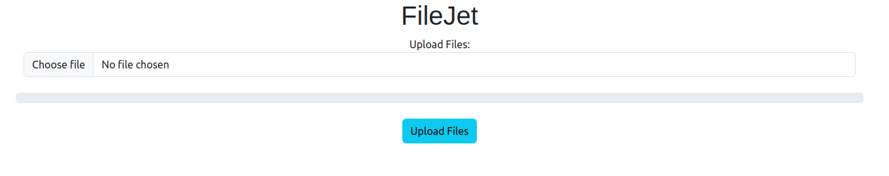
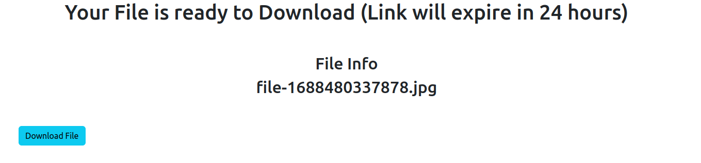
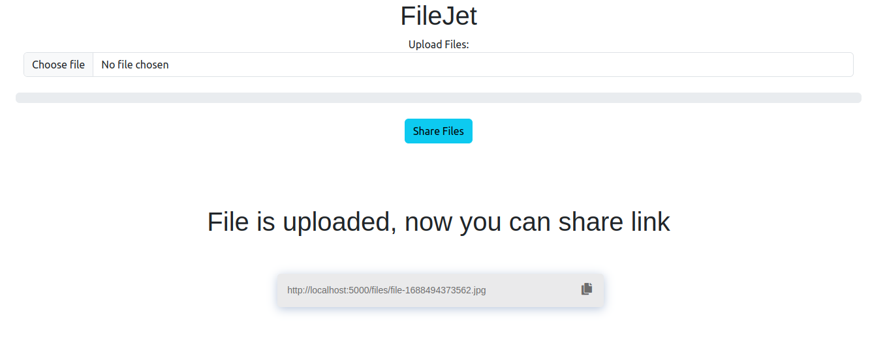

# FileJet
## A Peer-2-Peer File sharing App

   

FileJet is a Peer-2-Peer File Sharing App build on top of `NodeJS` and uses the `WebRTC` and `Socket.IO` in backend to share files.
Steps to recreate the application:
1. Create a `conda` environment. 
    - `conda create -n FileJet nodejs`
    - `conda activate FileJet`
2. Clone the repository in your terminal
    - `git clone https://github.com/urmilkalaria/FileJet.git`
    - `cd FileJet`
3. Installing Dependency
    - `npm run build`
4. Start the App
    - `npm run start` or `npm start`

## Demo Images

